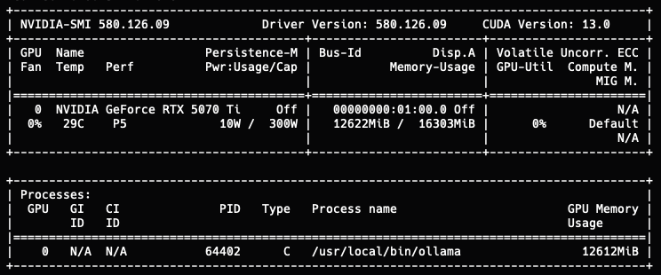

<div align="center">



# NVIDIA SMI API

Debugging and visibility tool for local Ollama GPU clusters.

Built to work with [ollama-ripper](https://github.com/shostkevych/ollama-ripper).

</div>

---

Lightweight Go service that exposes **nvidia-smi** GPU metrics and **Ollama** model stats via REST endpoints and a real-time WebSocket stream. GPU metrics refresh every 1s, Ollama stats every 5s.

| Method | Path | Description |
|--------|------|-------------|
| GET | `/api/gpus` | GPU metrics — temp, power, memory, utilization, PCIe, processes |
| GET | `/api/ollama/stats` | Ollama — running models, VRAM, KV cache budget, context window |
| GET | `/ws` | WebSocket stream — both GPU + Ollama combined, every 1s |

## Setup Go on Ubuntu

```bash
# Install Go
sudo apt update
sudo apt install -y golang-go

# Or install a specific version
wget https://go.dev/dl/go1.23.6.linux-amd64.tar.gz
sudo rm -rf /usr/local/go
sudo tar -C /usr/local -xzf go1.23.6.linux-amd64.tar.gz
echo 'export PATH=$PATH:/usr/local/go/bin' >> ~/.bashrc
source ~/.bashrc

# Verify
go version
```

## Build & Run

```bash
# Clone
git clone https://github.com/shostkevych/go-smi-api.git
cd go-smi-api

# Build
go build -o go-smi-api .

# Run (requires nvidia-smi and Ollama on the host)
./go-smi-api
# listening on :8080
```

## Usage

```bash
# GPU metrics
curl http://localhost:8080/api/gpus | jq .

# Ollama stats
curl http://localhost:8080/api/ollama/stats | jq .

# WebSocket (GPU + Ollama combined)
websocat ws://localhost:8080/ws
```
